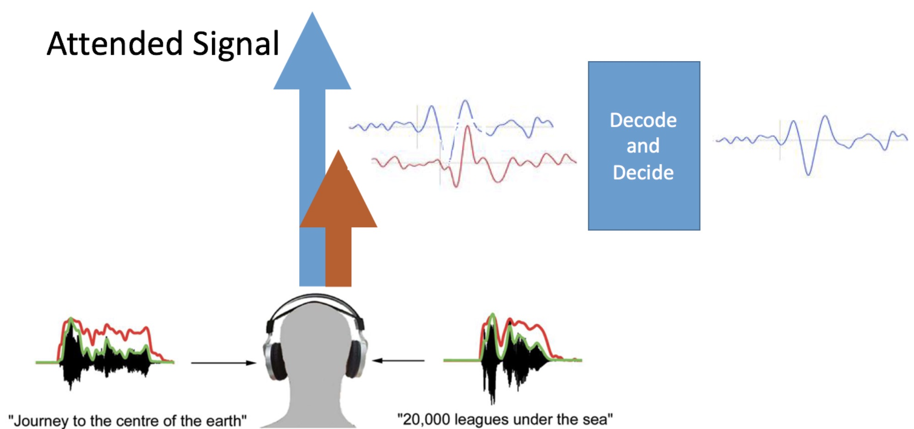

# Brain_decoding Library

(This is not an official Google product!)

This repository contains Python/Tensorflow code to decode perceptual signals
from brain data.  The perceptual signals we are using are generally audio
features.  And the brain data is one of several types of signals, such as EEG,
MEG and ECoG.

## License

This code uses the Apache License 2.0. See the LICENSE file for details.

## Purpose
This code builds and trains models that connect perceptual signals, primarily
audio, to brain signals, which can be EEG, MEG or ECOG. One common use for this
type of algorithm is to decode auditory attention, as shown in the figure below.

In attention decoding, we wish to know which of two (or more) signals a user is
attending. One signal (the upward pointing blue arrow) indicates that the signal
is being processed by the entire brain and is "exciting" all areas.  Another
signal is heard by the auditory system, but is not attended, and doesn't 
recruit as much of the brain. The two signals are processed differently, and
produce different brain signals.

This software helps to decide which signal the user is attending, by building 
a model that uses the EEG signal, for example, to predict the intensity of the
attended audio signal.

## Documentation
Documentation to follow (but there are extensive comments in the code.) The
three primary parts of this code are:

* decoding: Used to build, train and test models that connect audio and brain
signals.
* ingest: Use to read various kinds of file formats and transform the data into
TFRecords for use by the decoding program
* add_triggers: Used to add (randomly timed) trigger signals to an audio file
so the audio can be synced to the brain recordings

## References

James O'Sullivan, AJ Power, Nima Mesgarani, S. Rajaram, John Foxe,
Barbara Shinn-Cunningham, Malcolm Slaney, Shihab Shamma, Edward Lalor.
Attentional Selection in a Cocktail Party Environment Can Be Decoded from
Single-Trial EEG.
_Cereb Cortex_. 2015 Jul;25(7):1697-706.

Daniel D.E. Wong,  Søren A. Fuglsang,  Jens Hjortkjær, Enea Ceolini,  
Malcolm Slaney, Alain de Cheveigné.
A Comparison of Temporal Response Function Estimation Methods for 
Auditory Attention Decoding.
_Frontiers in Neuroscience_. doi: 10.3389/fnins.2018.00531.
